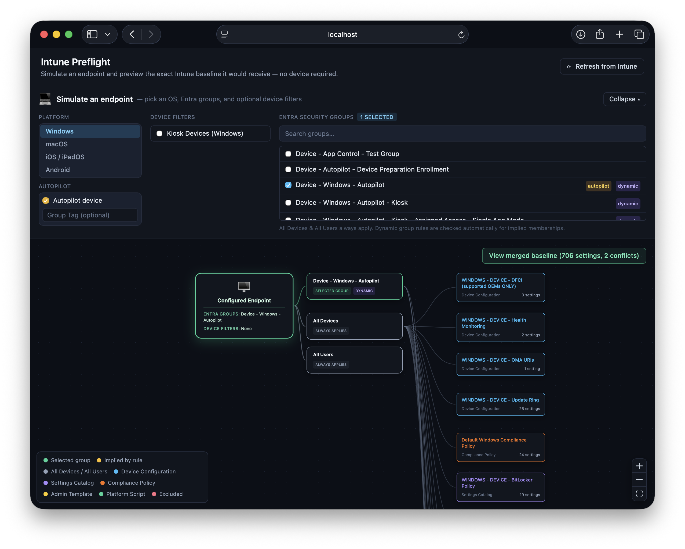
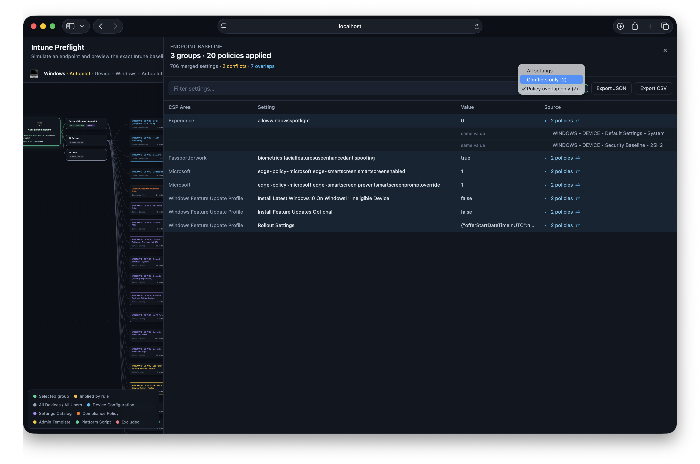

# Intune Preflight

**Run the assignment check before your devices ever take off.**

Intune makes you click into every Configuration Profile, Compliance Policy, Settings Catalog policy, and Administrative Template one at a time to work out what actually lands on a device. Intune Preflight connects to your tenant, reads every policy and its assignments, and lets you **simulate an endpoint** — pick an OS, the Entra groups it belongs to, its Autopilot Group Tag, and any Assignment Filters it matches — then computes the full merged CSP-level baseline that endpoint would receive. No hardware, no enrollment, no Policy Sets.

It's a read-only, self-hosted tool meant for validating and understanding assignments in a sandbox or production tenant before you roll changes out to real devices.



_Pick an OS, the Entra groups an endpoint belongs to, its Autopilot Group Tag, and any Assignment Filters — and see exactly which policies apply as a connected diagram._



_Drill into the full merged CSP baseline — every setting from every applied policy, with real conflicts and policy overlaps surfaced._

## Why preflight?

The normal loop is deploy-and-pray: assign a policy, wait for devices to check in, watch for failures and conflicts, dig into which policy actually won, fix it, then wait a few more days for the next check-in to confirm. **Intune Preflight collapses that loop** — simulate the endpoint up front and see its full merged baseline, conflicts, overlaps, and exclusions *before* you deploy. Less risk, far less reporting latency, and the confidence to design and manage your policy sets for the long term.

**This is an admin tool that deliberately sees everything.** It authenticates with tenant-wide, read-only *application* permissions, so it returns the **complete, unfiltered** picture of every policy and assignment in the tenant. Unlike the Intune console for a scoped admin, it is **not** filtered by RBAC scope tags or admin-unit boundaries — that's intentional. A meaningful preflight needs the whole tenant's configuration, not one admin's slice of it. Run it as the full-visibility "source of truth" alongside your scoped day-to-day roles.

## Features

- 🛫 **Endpoint simulator** — pick an OS platform and the Entra security groups an endpoint belongs to, and see exactly which policies apply as a connected diagram: device → groups → policies.
- 🏷️ **Autopilot Group Tag aware** — flag the endpoint as an Autopilot device and type its Group Tag; every dynamic group whose rule that tag satisfies (evaluating the `[OrderID]` `-eq` / `-startsWith` clauses, combined with `or`/`and`) is auto-selected in real time. The "Autopilot device" toggle also links the default Autopilot-joined groups (bare `[ZTDId]` rule).
- 🔗 **Dynamic group implication** — selecting a dynamic group whose membership rule logically guarantees membership in another dynamic group too (e.g. a narrower `[OrderID]` prefix) automatically adds that group, flagged "Implied by rule" so it can be eyeballed against Entra.
- 🚫 **Include/exclude aware** — Intune assignments can explicitly *exclude* a group from a policy; this is resolved correctly (excludes always win) and shown directly in the diagram and baseline, not silently dropped.
- 🎯 **Assignment Filter aware** — pick the Intune Assignment Filter(s) your simulated endpoint matches (e.g. "Kiosk Devices"); policies whose assignment includes/excludes a filter are resolved correctly, not just by group membership. A device can match several filters at once.
- 🌐 **Platform filter** — Windows, macOS, iOS/iPadOS, and Android policies are scoped separately so e.g. macOS compliance policies don't clutter a Windows simulation.
- 🔍 **Merged baseline drill-down** — every CSP setting from every applied policy, merged into one filterable table, with genuine **conflicts** (same setting, different values) and **policy overlaps** (same setting, same value) surfaced separately.
- 📤 **Export** — JSON or CSV export of the simulated endpoint's full baseline.
- 🔄 **Refresh from Intune** — an in-memory cache keeps things fast; one click clears it and re-reads the tenant after you make changes in the admin center.
- 🪶 **Lightweight** — no database, runs as one small API process + one static web app (or two containers via Docker).

### What's included in the baseline

**Covered:** Device Configuration profiles (all platforms, incl. Apple/Android Wi-Fi, VPN, certs, custom) · Settings Catalog — **including Security Baselines and Endpoint Security policies** (Antivirus, Disk Encryption, etc.) now delivered through the unified settings platform · Compliance policies · Administrative Templates (ADMX) · Platform Scripts (Windows PowerShell + macOS shell) · Windows Feature / Quality / Driver Update profiles.

**Not yet covered:** only **legacy Endpoint Security / Security Baselines still stored as `deviceManagement/intents`** — the older object model Microsoft has largely migrated into the Settings Catalog. Modern baselines (which show a `baseline` template in the unified settings experience — most tenants now) are **already covered**; only tenants that still have old intents-based policies will see a gap. Planned for v1 — see [ROADMAP.md](ROADMAP.md).

**Intentionally excluded:** Proactive Remediations, enrollment-time policies (Device Preparation / ESP / enrollment restrictions), and app-level MAM / app configuration.

## How it works

```
Microsoft Graph  --->  apps/server (Fastify)  --->  apps/web (React + React Flow)
 (app-only auth)        in-memory cache              endpoint simulator + drill-down
                         simulation engine
```

The server authenticates to Microsoft Graph using an Entra **app registration** (client-credentials flow — no per-user sign-in), pulls every policy along with its group assignments (both included and excluded), the assignment filters, the Autopilot deployment profiles, and the security groups (with their dynamic membership rules), then computes a merged baseline for whatever combination of groups / platform / filters you select. Results are cached in memory for `CACHE_TTL_SECONDS` (default 300s) — there is intentionally no database, to keep the app easy to run and reason about. The **Refresh from Intune** button (or `POST /api/refresh`) clears the cache on demand.

<!-- Add a screenshot or short GIF of the simulator here before publishing. -->

## Who can install this — required Entra roles

The app uses **application (app-only) permissions**, which require **admin consent**. Granting that consent is a privileged action:

- **Reading the data** afterwards only needs the read-only Graph scopes below — well within what an **Intune Administrator** can see.
- **Creating the app registration and granting admin consent** needs a higher role: **Global Administrator**, or **Privileged Role Administrator** / **Cloud Application Administrator** / **Application Administrator**.

So if you are *only* an Intune Administrator, you will need a Global Admin (or one of the roles above) to create the app registration and click **Grant admin consent** once. After that, day-to-day use needs no elevated role.

## 1. Create an Entra app registration

1. Go to [entra.microsoft.com](https://entra.microsoft.com) → **Identity → Applications → App registrations → New registration**.
2. Name it something like `intune-preflight`, leave the redirect URI blank, click **Register**.
3. Under **API permissions → Add a permission → Microsoft Graph → Application permissions**, add:

   | Permission | Needed for | Required? |
   |---|---|---|
   | `DeviceManagementConfiguration.Read.All` | Configuration profiles, Compliance, Settings Catalog, Administrative Templates, Assignment Filters | **Required** |
   | `Group.Read.All` | Resolving group names and reading dynamic membership rules | **Required** |
   | `DeviceManagementServiceConfig.Read.All` | Windows Autopilot deployment profiles | Optional — skipped gracefully if omitted |
   | `DeviceManagementScripts.Read.All` | Platform Scripts (Windows PowerShell + macOS shell) | Optional — skipped gracefully if omitted |

4. Click **Grant admin consent** for your tenant (needs one of the roles noted above).
5. Under **Certificates & secrets → New client secret**, create a secret and copy its value immediately (it's only shown once).
6. Note your **Application (client) ID**, **Directory (tenant) ID**, and the **client secret** value.

Full reference: [Microsoft Graph permissions reference](https://learn.microsoft.com/en-us/graph/permissions-reference).

## 2. Configure

Copy the example env file to `.env`:

```bash
# macOS / Linux
cp .env.example .env
```
```powershell
# Windows (PowerShell)
Copy-Item .env.example .env
```
```bat
:: Windows (Command Prompt)
copy .env.example .env
```

Fill in `TENANT_ID`, `CLIENT_ID`, and `CLIENT_SECRET` from step 1. `PORT` (default 4000) and `CACHE_TTL_SECONDS` (default 300) are optional. On Windows, save `.env` with **LF** line endings and bare `KEY=value` (no quotes) so Docker reads the values cleanly.

## 3. Run

### Option A: Docker (recommended — closest to a real deployment)

```bash
docker compose up --build
```

- Web UI: http://localhost:8080

This builds and runs both the compiled API and the static web app — the same packaging anyone cloning the repo gets.

### Option B: npm (for local development, requires Node.js 20+)

```bash
npm install
npm run dev
```

- Web UI: http://localhost:5173 (the dev server, with hot reload)
- API: http://localhost:4000 (the UI proxies `/api` calls here automatically)

`npm run dev` runs both processes together and reloads on every file change — ideal while iterating. To test the production build locally instead, run `npm run build`, then `npm start -w apps/server` and `npm run preview -w apps/web`.

## Project layout

```
apps/server/      Fastify API — Graph auth, data fetch, simulation engine
apps/web/         React + Vite UI — endpoint simulator (React Flow) + drill-down panel
packages/shared/  TypeScript types + rule helpers shared by both apps
```

## API

| Endpoint | Description |
|---|---|
| `GET /api/health` | Liveness check |
| `GET /api/groups` | Security groups referenced by assignments, with policy/setting/conflict counts and membership rules |
| `GET /api/filters` | Intune Assignment Filters available in the tenant |
| `GET /api/simulate?groups=id1,id2&platform=windows&deviceFilterIds=id1,id2` | Simulated endpoint baseline for the given groups, platform (`windows`\|`macos`\|`ios`\|`android`), and Assignment Filter(s) |
| `GET /api/simulate/export?groups=...&platform=...&deviceFilterIds=...&format=json\|csv` | Download the simulated baseline |
| `POST /api/refresh` | Clear the in-memory cache and re-fetch from Graph |

> Autopilot "device" and Group Tag selection are resolved in the web UI (they drive which group ids get sent in `groups`), so the API surface stays a simple "given these groups, compute the baseline."

## Security

Read this before you host it anywhere other than your own machine:

- **No built-in authentication.** Intune Preflight has no login and does not authenticate API callers. Anyone who can reach the web UI or the API port can read the policy data it surfaces.
- **The server listens on all interfaces** (`0.0.0.0`) so it can be reached from other devices. Combined with the point above, that means you should **run it on localhost or a trusted private network / VPN, and never expose the server or web port directly to the internet** without putting your own authentication in front of it (e.g. a reverse proxy with access control).
- **Credentials stay server-side.** `TENANT_ID` / `CLIENT_ID` / `CLIENT_SECRET` live only in the server's `.env`, are never sent to the browser, and `.env` is gitignored — keep it out of source control.
- **Read-only.** The Graph permissions are all `*.Read.All`; the tool never writes to your tenant.
- **Full-tenant visibility by design.** Because it uses application (app-only) permissions, it sees the *entire* tenant's configuration — it is **not** filtered by RBAC scope tags or admin units. That's the intended behavior (a preflight needs the whole picture), but it means the `.env` app registration is effectively a tenant-wide read key: protect it accordingly, scope the app registration to only the permissions listed above, and rotate the client secret periodically.

## Troubleshooting

- **"Network error / network request failed" in the browser, and the groups never load.** The web app reached the server, but the server couldn't reach Microsoft. Check the server logs (`docker compose logs server`) for the real cause:
  - **`ClientAuthError: network_error` / `ENETUNREACH`** — the container has an IPv6 address but no working IPv6 route (common on Docker Desktop / WSL2), so the token call to `login.microsoftonline.com` fails. This repo already disables IPv6 in the container (`sysctls` in `docker-compose.yml`) and prefers IPv4 in the server, which fixes it. If you removed those, put them back.
  - **`ENOTFOUND` / DNS errors** — the container can't resolve names. Restart Docker Desktop, or run `wsl --shutdown` (Windows) and start it again.
- **Docker CLI says `failed to connect to Docker API at npipe://…`** — Docker Desktop isn't running or hasn't finished starting. Launch it, wait for **"Engine running,"** and confirm with `docker version` (you want a **Server:** section).
- **Can't reach it from another device** (e.g. a tablet) even though `localhost` works — allow Docker through the **Private** profile in Windows Defender Firewall, and browse to `http://<host-ip>:8080`.
- **A `403` in the logs after pointing at a new tenant** — the app registration's permissions were added but **admin consent wasn't granted** (or hasn't propagated yet, which can take several minutes). Confirm each permission shows **"Granted for &lt;tenant&gt;."**
- **Changed `.env` but nothing changed** — recreate the container so it picks up the new values: `docker compose down` then `docker compose up --build`. On Windows, make sure `.env` uses **LF** line endings and bare `KEY=value` (no quotes).

## Notes & limitations

- **Read-only.** This tool never writes to your tenant — the Graph permissions used are all `*.Read.All`.
- **In-memory cache, no database.** Data is re-fetched from Graph on the first request after each cache expiry, a refresh, or a server restart. If you need persistence across restarts or multiple instances, swap `apps/server/src/cache.ts` for Redis or SQLite.
- **Settings flattening is schema-agnostic.** Configuration and Compliance settings are derived directly from each Graph resource's own properties rather than a hand-maintained CSP schema per profile type — this keeps the tool maintainable as Intune adds new policy types, at the cost of raw Graph field names showing up as setting names in some cases.
- **Dynamic membership is evaluated best-effort, not queried.** The app does not ask Graph whether a specific device/user is in a group; it reasons over the membership *rules*:
  - **Group Tag matching** evaluates a group's `[OrderID]` clauses (`-eq` / `-startsWith`, combined with a single level of `or` / `and`).
  - **Rule implication** and the **Autopilot-joined** link (`[ZTDId]`) are heuristics over the same clause shapes.
  - **Combined / nested dynamic-group rules are not fully evaluated** — rules that nest parentheses, mix device properties (e.g. an `[OrderID]` clause `and` a `deviceOSType` check), or use operators beyond `-eq`/`-startsWith` may be missed or over-matched by the Autopilot/Group Tag auto-selection. A proper rule-expression evaluator is planned for v1 — see [ROADMAP.md](ROADMAP.md).

  Implied and auto-selected groups are always surfaced in the UI so you can verify them — always double-check against the real rules in Entra before relying on the result.
- **Overlap detection is Windows-only** for now (other platforms surface false overlaps from shared profile metadata); conflicts apply on all platforms. See [ROADMAP.md](ROADMAP.md) for the full list of known limitations and planned v1 work.
- **Tested against sandbox Microsoft 365 tenants.** Always verify against the Intune admin center before relying on the computed baseline for compliance decisions.

## Disclaimer

Intune Preflight is an independent, community-built tool. It is **not affiliated with, endorsed by, or sponsored by Microsoft**. Microsoft, Intune, and Entra are trademarks of the Microsoft group of companies, used here only to describe what the tool works with.

## License

MIT — see [LICENSE](LICENSE).
