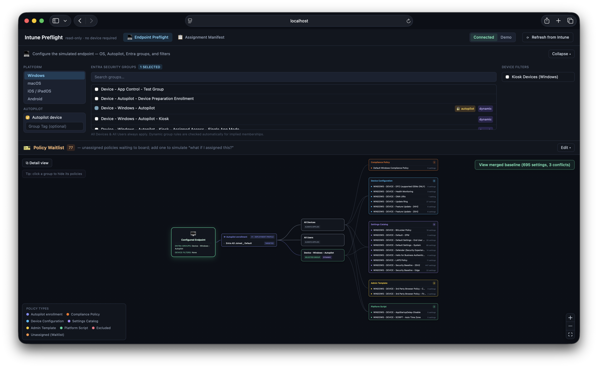

# Intune Preflight

**Validate Intune policies & assignment logic before your devices ever take off.**

Intune makes you click into every Configuration Profile, Compliance Policy, Settings Catalog policy, and Administrative Template one at a time to work out what actually lands on a device. Intune Preflight connects to your tenant, reads every policy and its assignments, and lets you **simulate an endpoint** — pick an OS, the Entra groups it belongs to, its Autopilot Group Tag, and any Assignment Filters it matches — then computes the full merged CSP-level baseline that endpoint would receive. No hardware, no enrollment, no Policy Sets.

It's a **read-only, self-hosted** tool for validating and understanding assignments in a sandbox or production tenant before you roll changes out to real devices.



_Pick an OS and the Entra groups an endpoint belongs to, and see exactly which policies apply as a connected diagram: endpoint → Autopilot → groups → policies._

## Try it in 30 seconds (demo mode)

No tenant and no app registration required — the tool ships with a **bundled sample tenant**. Clone the repo, or download the [latest release](https://github.com/kevinmalinoski/intune-preflight/releases/latest):

```bash
npm install
npm run dev        # server :4000, web :5173 — open http://localhost:5173
```

With no `.env` present it starts in **Demo** mode against synthetic data that exercises every feature: a conflict, an overlap, an exclude-wins case, an All Devices + include-filter case, dynamic Group Tag implication, an unassigned policy, and Autopilot V1 + V2. A **Demo / Connected** toggle in the header flips between the sample data and your real tenant — **Connected** unlocks once you add a `.env`.

➡️ **[Full setup guide — app registration, config, Docker](docs/SETUP.md)**

## Why preflight?

The normal loop is deploy-and-pray: assign a policy, wait for devices to check in, watch for failures and conflicts, dig into which policy actually won, fix it, then wait a few more days for the next check-in to confirm. **Intune Preflight collapses that loop** — simulate the endpoint up front and see its full merged baseline, conflicts, overlaps, and exclusions *before* you deploy.

**This is an admin tool that deliberately sees everything.** It authenticates with tenant-wide, read-only *application* permissions, so it returns the **complete, unfiltered** picture of every policy and assignment. Unlike the Intune console for a scoped admin, it is **not** filtered by RBAC scope tags or admin-unit boundaries — that's intentional. A meaningful preflight needs the whole tenant's configuration, not one admin's slice of it.

## What it does

- 🛫 **Endpoint simulator** — device → Autopilot → groups → policies as a live diagram, with a merged CSP baseline behind it.
- 🏷️ **Autopilot aware** — Group Tag simulation, plus **V1 deployment profiles and V2 device-preparation** policies shown as an enrollment stage (including dual-targeting).
- 🎯 **Assignment Filter simulation** — toggle the filters a device matches and watch every policy re-resolve; include and exclude filters are handled as the opposites they are.
- 🎫 **Policy Waitlist** — pull an *unassigned* policy into the simulation to preview "what if I assigned this?"
- 🔍 **Merged baseline drill-down** — every setting from every applied policy in one filterable grid, with the real **CSP path** and a **Microsoft Learn** link per setting.
- ⚔️ **Conflicts & overlaps** — genuine value disagreements vs redundant duplicate configuration, surfaced separately (Windows).
- 🛡️ **Legacy Endpoint Security** — intents-based BitLocker, Defender Antivirus, Firewall and ASR policies read and merged alongside modern Settings Catalog ones.
- 📋 **Assignment Manifest** — a tenant-wide map of which groups carry which policies, with filter simulation and CSV export.
- 🔗 **Manifest ↔ Simulator** — check groups in the Manifest and *simulate a device in exactly those groups*; per-group **"seating charts"** reveal at a glance whether a group's policies are its own or shared across the tenant.
- 🌐 **Four platforms** — Windows, macOS, iOS/iPadOS, and Android, scoped separately.
- 📤 **Export** — JSON or CSV from both the simulator and the Manifest.

➡️ **[Full feature walkthrough with screenshots](docs/FEATURES.md)**

## What's included in the baseline

**Covered:** Device Configuration profiles (all platforms, incl. Apple/Android Wi-Fi, VPN, certs, custom) · Settings Catalog — **including Security Baselines and Endpoint Security policies** (Antivirus, Disk Encryption, etc.) now delivered through the unified settings platform · **legacy Endpoint Security & Security Baselines** still stored as `deviceManagement/intents` (legacy BitLocker / Disk Encryption, Defender Antivirus, Firewall, ASR, …) · Compliance policies · Administrative Templates (ADMX) · Platform Scripts (Windows PowerShell + macOS shell) · Windows Feature / Quality / Driver Update profiles.

**Intentionally excluded:** Proactive Remediations, enrollment-time policies (ESP / enrollment restrictions), and app-level MAM / app configuration.

**On user targeting:** policies assigned to Entra **user groups are resolved** — user groups are selectable like any other group, and the **All Users** virtual group always applies. What's out of scope is modelling a **specific user identity**: the tool never evaluates whether a named user belongs to a group, so nothing is inferred from who signs in. (That's also why Autopilot V2 resolves by its configured device group rather than its user assignment — see [FEATURES.md](docs/FEATURES.md#autopilot-profile-associations-v1--v2).)

## Known limitations

Honest edges in v1.1 — none block the core use, but know them before you rely on a result:

- **Dynamic membership is evaluated best-effort, not queried.** Group Tag / Autopilot auto-selection reads only the `[OrderID]` and `[ZTDId]` clauses in `device.devicePhysicalIds` (`-eq` / `-startsWith`). A bare `[ZTDId]` clause combined with **`or`** is handled correctly (any satisfied branch grants membership); rules that gate it behind **`and`**, or that depend on other conditions entirely, may be **missed or over-matched**. Auto-selected and implied groups are always flagged in the UI so you can verify them against Entra.
- **Conflict & overlap detection is Windows-only.** Other platforms don't map cleanly onto value-level comparison yet. The **merged baseline itself is still shown on every platform** — only the conflict/overlap flags are Windows-scoped.
- **Legacy Endpoint Security intents use schema-agnostic setting names.** Legacy `deviceManagement/intents` (BitLocker, Defender AV, Firewall, …) are read, but their setting names are derived from the Graph `definitionId` rather than a hand-maintained CSP map, and their ids don't line up with the equivalent Settings Catalog setting — so a legacy intent and a modern Settings Catalog policy setting the *same* thing aren't yet cross-detected as a conflict (two legacy intents are).
- **Settings flattening is schema-agnostic** — derived from each Graph resource's own properties rather than a hand-maintained CSP schema, so raw Graph field names show up as setting names in some cases.
- **Tested against sandbox Microsoft 365 tenants.** Always verify against the Intune admin center before relying on a computed baseline for compliance decisions.

➡️ **[Full limitations and planned v2 work — ROADMAP.md](ROADMAP.md)**

## Security

Read this before you host it anywhere other than your own machine:

- **No built-in authentication.** There is no login and API callers are not authenticated. Anyone who can reach the web UI or API port can read the policy data it surfaces.
- **The server listens on all interfaces** (`0.0.0.0`). Combined with the point above: **run it on localhost or a trusted private network, and never expose it directly to the internet** without putting your own authentication in front of it.
- **Read-only.** Every Graph permission is `*.Read.All`; the tool never writes to your tenant.
- **Credentials stay server-side.** `TENANT_ID` / `CLIENT_ID` / `CLIENT_SECRET` live only in the server's `.env`, are never sent to the browser, and `.env` is gitignored.
- **Full-tenant visibility by design.** App-only permissions mean it sees the *entire* tenant's configuration, unfiltered by scope tags or admin units. That's intended — but it makes the app registration effectively a tenant-wide read key. Protect it, grant only the permissions listed in the setup guide, and rotate the secret periodically.

## Documentation

| Doc | What's in it |
|---|---|
| **[docs/FEATURES.md](docs/FEATURES.md)** | Full walkthrough of the simulator and the Assignment Manifest, with screenshots |
| **[docs/SETUP.md](docs/SETUP.md)** | Entra app registration, permissions, `.env`, Docker / npm, API reference, troubleshooting |
| **[ROADMAP.md](ROADMAP.md)** | Known limitations in detail and planned v2 work |
| **[CHANGELOG.md](CHANGELOG.md)** | Release history |

## Acknowledgments

Designed and built by Kevin Malinoski, pair-programmed with [Claude Code](https://claude.com/claude-code) (Anthropic). AI-assisted commits carry a `Co-Authored-By` trailer in the Git history.

## Disclaimer

Intune Preflight is an independent, community-built tool. It is **not affiliated with, endorsed by, or sponsored by Microsoft**. Microsoft, Intune, and Entra are trademarks of the Microsoft group of companies, used here only to describe what the tool works with.

## License

MIT — see [LICENSE](LICENSE).
