# Features

A walkthrough of what Intune Preflight does. Two surfaces: the **Endpoint Preflight** simulator (what would *this device* get?) and the **Assignment Manifest** (which groups carry which policies, tenant-wide).

> Everything here is read-only. The tool never writes to your tenant.

- [Endpoint Preflight — the simulator](#endpoint-preflight--the-simulator)
- [Assignment Manifest](#assignment-manifest--new-in-v1)

---

# Endpoint Preflight — the simulator

Describe an endpoint, and the tool resolves every policy that would land on it — the way Intune resolves it, including excludes, filters, and inheritance.


_The full flow: configured endpoint → Autopilot enrollment → Entra groups → the policies each group brings._

## Entra group assignment

Pick the Entra security groups the endpoint is associated with. Policies resolve live as you select — you see the merged result immediately, not after a device check-in.

**Device *and* user groups are both resolved.** Any Entra group referenced by an assignment is selectable, so a policy targeted at a user group resolves exactly like one targeted at a device group. The tool doesn't model a specific user identity (it never evaluates whether a named user is in a group) — you tell it which groups are in play, and it does the assignment math from there.

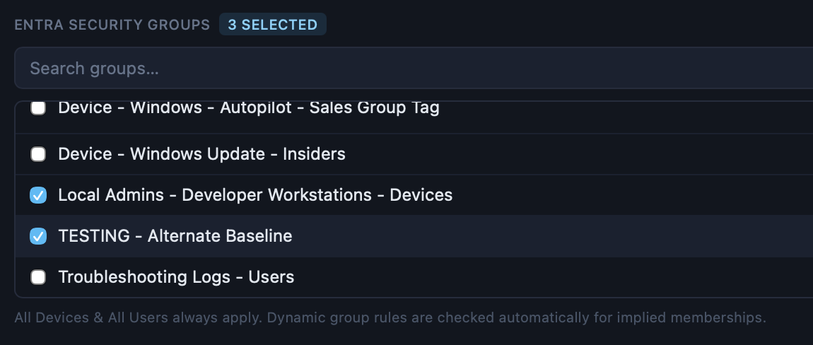

_Search and select the groups an endpoint belongs to. **All Devices** and **All Users** always apply and are added automatically._

Three things happen automatically:

- **All Devices / All Users** are always in play — every device inherits them, so they're always shown.
- **Exclude wins.** If any selected group is excluded from a policy, that policy is dropped from the applied set and shown as an exclude — never silently omitted, and never wrongly counted as applied.
- **Implied groups.** Selecting a dynamic group whose rule logically *guarantees* membership in a broader one adds that group too, flagged **"Implied by rule"** so you can eyeball it against Entra. This is deliberately narrow: it only fires between rules built **solely** from `devicePhysicalIds` clauses — a narrower Group Tag prefix implying a broader one (`SALES-KIOSK-MULTI` ⇒ `SALES-KIOSK`), or any Autopilot-tagged group implying a bare `[ZTDId]` group. The moment a rule mixes in another condition (ownership, OS type, device model), membership depends on something the tool can't evaluate, so **no implication is claimed** — two rules merely *sharing* a condition are not related.

## Autopilot Group Tag simulation (V1)

Flag the endpoint as an Autopilot device and enter its **Group Tag**. The tool auto-selects the dynamic groups whose Group Tag rule matches.

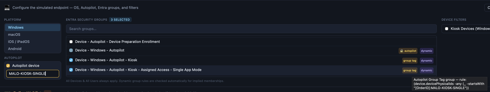

_Set the Group Tag and the matching dynamic groups are selected for you, each flagged so you can verify it._

> **⚠️ Known restriction — dynamic group auto-selection.**
> Auto-selection reads **only** the `[OrderID]` (Group Tag) and `[ZTDId]` (Autopilot-joined) clauses inside `device.devicePhysicalIds`, using `-eq` / `-startsWith` (plus `-contains` for `[ZTDId]`).
>
> Any **other** condition in a membership rule — device model, OS version, enrollment profile, ownership — is **ignored**. A group whose membership actually comes from one of those conditions may be **missed**, and a group with extra narrowing conditions may be **over-matched**.
>
> Auto-selected and implied groups are always surfaced in the UI, and you can always select or deselect groups manually. A full rule-expression evaluator is the headline item for v2 — see [ROADMAP.md](../ROADMAP.md).

**`or` is handled correctly, with operator precedence.** A bare `[ZTDId]` clause is satisfied by *every* Autopilot-registered device, so whenever it stands as a top-level `or` branch the group is selected — any satisfied branch grants membership. Entra applies standard precedence (`and` binds tighter than `or`), so this very common real-tenant shape resolves as `(ownership and trust and appId and osType) or (ZTDId)` — and an Autopilot device is a member via that last branch regardless of the `and` chain:

```
(device.deviceOwnership -eq "Company") and (device.deviceTrustType -eq "AzureAD")
  and (device.deviceManagementAppId -contains "0000") and (device.deviceOSType -eq "Windows")
  or (device.devicePhysicalIDs -any (_ -contains "[ZTDId]"))
```

An `and` **inside the ZTDId branch itself** is the opposite case — membership would also depend on a condition this evaluator can't check, so the group is left for manual selection rather than risking a false positive:

```
(device.devicePhysicalIDs -any (_ -contains "[ZTDId]"))
  and (device.deviceModel -not -startsWith "Cloud PC")     ← not auto-selected
```

A `[ZTDId]` pinned to a specific device (`"[ZTDId]:<guid>"`) doesn't count as "any Autopilot device" either.

## Assignment Filter simulation

Choose which Intune Assignment Filters the simulated device matches. Policies scoped by a filter re-resolve accordingly — and the two filter directions are treated as the opposites they are:

| Filter type | Drops the policy when… | Reads as |
|---|---|---|
| **Exclude** | the device **matches** the filter | "this device matches *Kiosk Devices*, which this policy excludes" |
| **Include** | the device **does not match** the filter | "only applies to devices matching *VPN-Eligible*, this device doesn't" |

That distinction matters: an **All Devices assignment with an include filter** looks like it applies to everything, but actually only targets the filtered subset — the tool says so explicitly instead of just reporting "excluded."

## Collapsed vs. Detail view

The diagram groups policies by type by default, so a 150-policy tenant stays readable. Toggle **Detail view** to expand every policy into its own node.

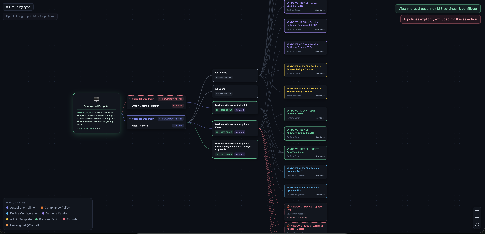

_Detail view — every applied policy as its own node. Excluded policies are dashed in red, and both Autopilot V1 profiles (one targeted, one excluded) are shown._

## Hide a group's policies

Click any Entra group in the diagram to hide the policies it contributes. Useful for isolating what a *single* group is responsible for when several overlap.

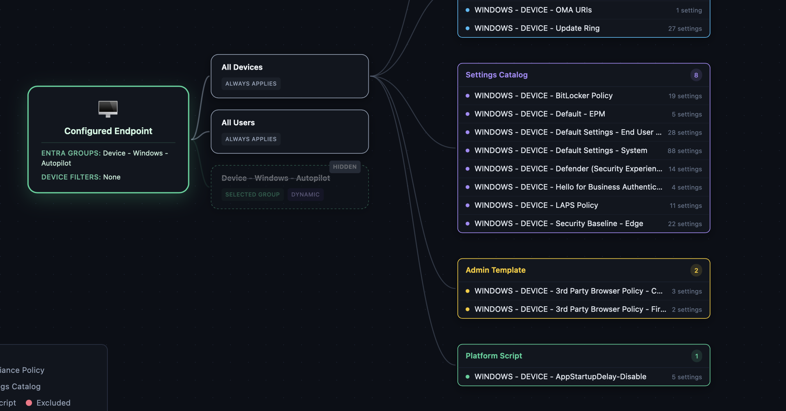

_Click a group to fold away its policies; click again to bring them back._

## Policy Waitlist — "what if I assigned this?"

Policies that exist in your tenant but are assigned to **nothing** never show up in a normal simulation. The **Policy Waitlist** lists them and lets you pull any of them into the simulation to preview the impact before you ever create the assignment.

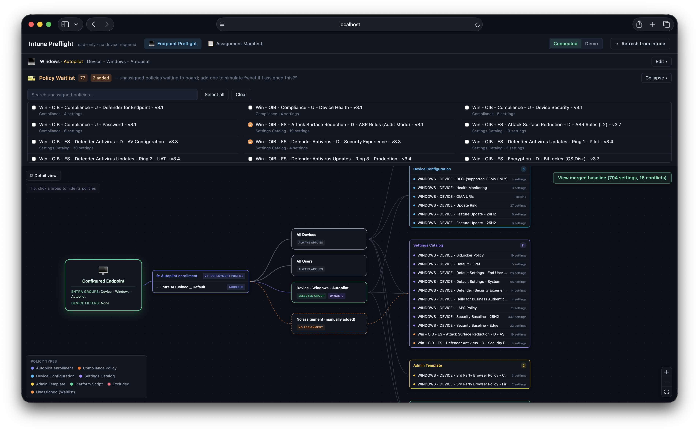

_Unassigned policies waiting to board. Add one — or Select all — to see what it would do to this endpoint._

## Merged baseline & policy drill-down

The heart of the tool: every CSP setting from every applied policy, merged into one filterable grid.

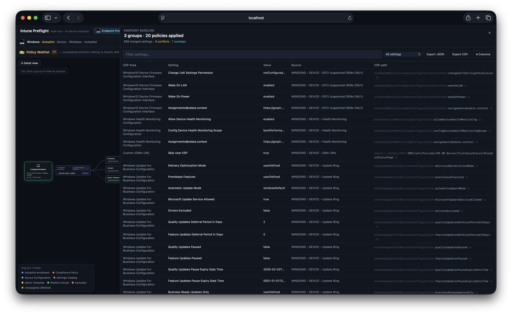

_Every setting from every applied policy, merged, filterable, and traceable back to its source policy._

- **Drill down from anywhere** — click a policy type bubble or an individual policy in the diagram to open the baseline scoped to it.
- **Resizable columns and a column picker** — show and hide columns Intune-style; your layout persists.
- **Source tracing** — every setting shows which policy set it.
- **Human-readable names and values** — Settings Catalog settings resolve to their real display names and option labels (e.g. "Enabled") rather than raw definition IDs.
- **Export** — JSON or CSV of the full merged baseline.

## CSP paths & OMA-URIs

Each setting carries its real **CSP path** (e.g. `./Device/Vendor/MSFT/BitLocker/RequireDeviceEncryption`) plus a direct **Microsoft Learn** documentation link, so you can jump from "this setting applies" to "here's what it actually does."

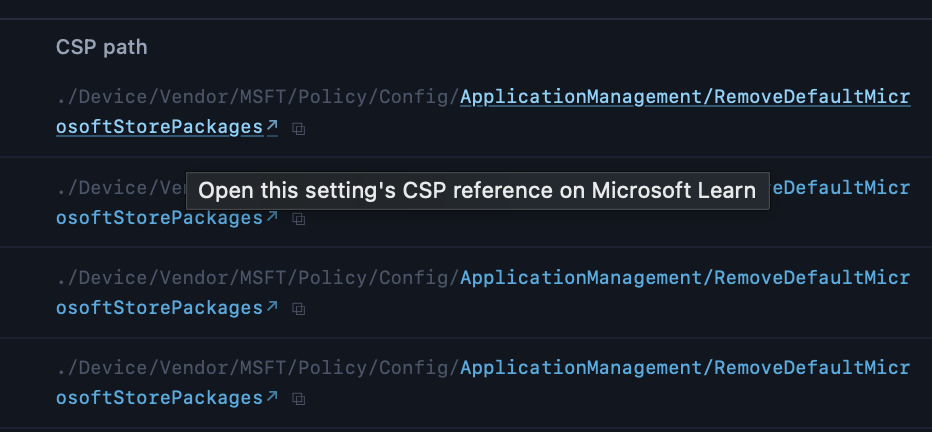

_The CSP path column, with a per-setting link to the Microsoft Learn documentation for that CSP._

**Windows Custom (OMA-URI) profiles** are handled as first-class settings: each `omaSettings` entry is keyed on its OMA-URI, so two custom profiles writing the same URI are correctly detected as a genuine conflict or overlap — not treated as unrelated.

## Policy overlap & conflict detection (Windows)

When two applied policies touch the same setting, the tool distinguishes:

- **Conflict** — same setting, **different** values. A real disagreement Intune will resolve silently; you want to know.
- **Overlap** — same setting, **same** value. Not a problem, but redundant configuration worth cleaning up.

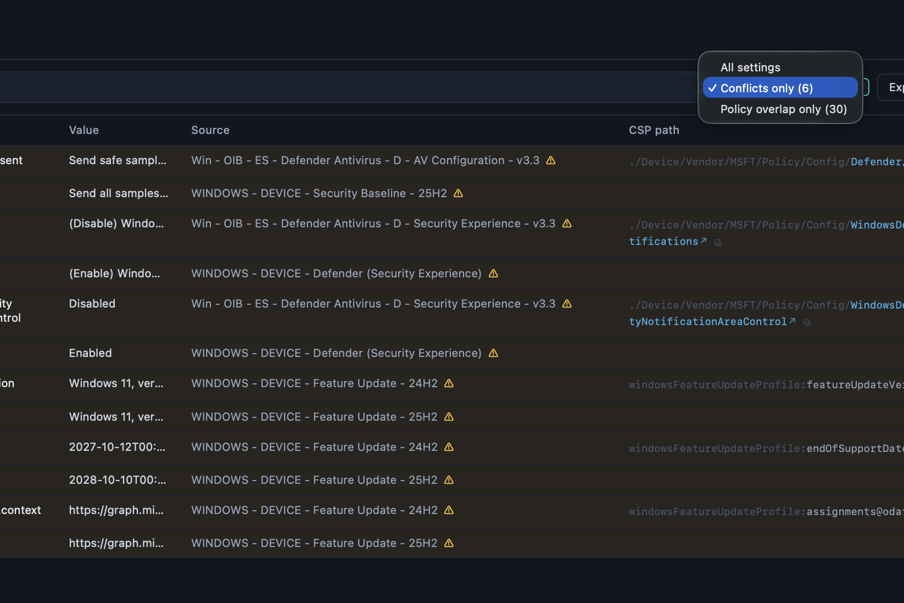

_Genuine conflicts and redundant overlaps, surfaced separately with every contributing policy._

> **Windows only.** Value-level comparison isn't trustworthy on other platforms yet — macOS `.mobileconfig` profiles share metadata that reads as false overlaps, and the common one-concern-per-macOS-compliance-policy pattern produces false conflicts. Both flags are therefore suppressed off Windows. **The merged baseline itself still renders on every platform** — only the conflict/overlap flags are Windows-scoped. See [ROADMAP.md](../ROADMAP.md).

## Autopilot profile associations (V1 & V2)

Autopilot appears as an **enrollment stage** between the endpoint and its Entra groups, showing which deployment profile the device would enroll through.

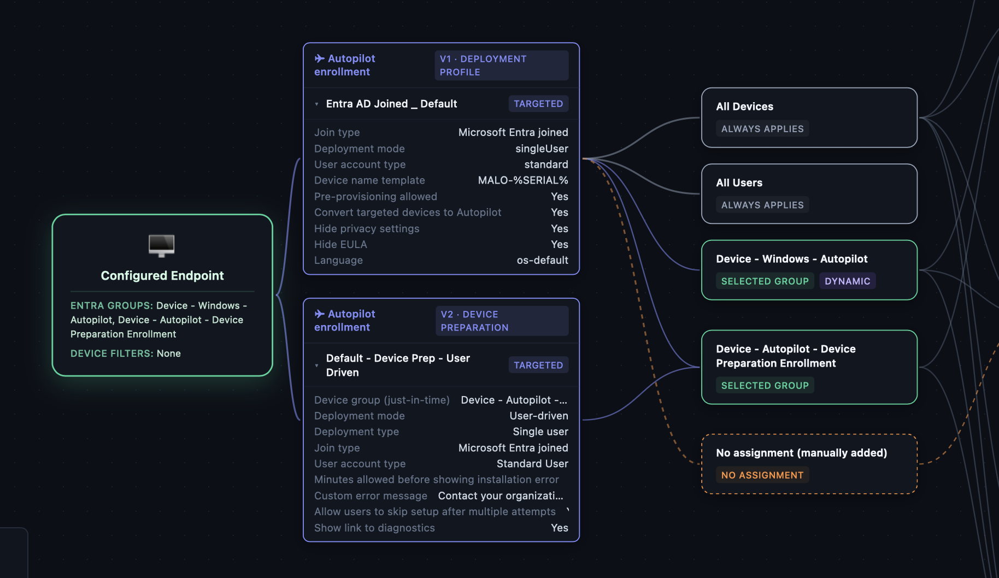

_Autopilot V1 deployment profiles and V2 device-preparation policies, with the groups they target. Cards are collapsed by default — click to expand the deployment settings._

- **V1** — `windowsAutopilotDeploymentProfiles`, targeted by device group. Exclusions are evaluated.
- **V2** — Windows Autopilot **device preparation** policies. Targeting keys on the policy's **configured just-in-time device group**, not its user assignment.
- **Dual targeting is detected** — when a V1 and a V2 profile both target the same device group (common where V1 retroactively enrolls after a V2 rollout), both are shown so you can see the overlap.
- Cards are **collapsed by default**; expand for join type, deployment mode, account type, device name template, and the rest.

> **ℹ️ Why V2 resolves by device group.**
> Autopilot V2 is a user-driven experience, but this tool doesn't model a **specific user identity** — it never evaluates whether a named user belongs to a group, so nothing can be inferred from who signs in. V2 is therefore resolved by its **configured just-in-time device group**, which keeps the result deterministic for a device-centric simulation.
>
> To be clear: **user-group assignments are still resolved everywhere else.** Entra user groups are selectable like any other group, the **All Users** virtual group always applies, and both are counted in the Assignment Manifest. What's absent is inferring membership from a sign-in.
>
> We understand this isn't full V2 logic. It's included because the deployment context genuinely helps you understand and validate an Intune configuration. **Richer user / user-group modelling is a candidate for v2** — see [ROADMAP.md](../ROADMAP.md).

## Platform support

Windows, macOS, iOS/iPadOS, and Android are scoped separately, so a Windows simulation never gets cluttered with macOS compliance policies.

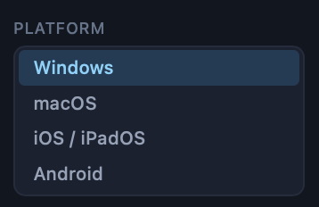

_Switch platform to scope the whole simulation — policies, filters, and the waitlist all follow._

| Platform | Baseline | Conflicts & overlaps |
|---|---|---|
| Windows | ✅ | ✅ |
| macOS | ✅ | Suppressed (see above) |
| iOS / iPadOS | ✅ | Suppressed |
| Android | ✅ | Suppressed |

> **Roadmap:** enrollment profiles, and Android policy-type breakdown, are longer-term items — see [ROADMAP.md](../ROADMAP.md).

---

# Assignment Manifest

The simulator answers *"what would this one device get?"* The Manifest answers the tenant-wide question: **which groups carry which policies, and what does a member of each group actually receive?**

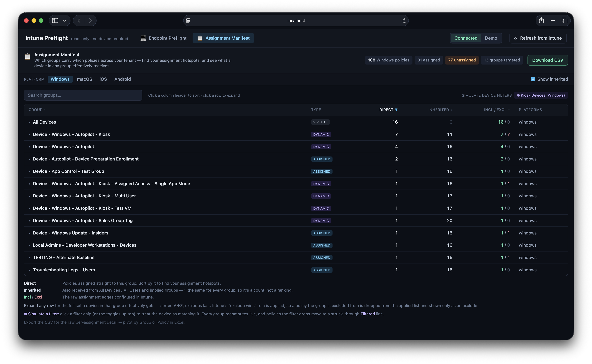

_Every policy → group assignment across the tenant, per platform. Sort by Direct to find your assignment hotspots._

## Purpose

Use it to understand your **policy sets and mappings for every configured Entra group** — where configuration is concentrated, which groups are doing the heavy lifting, and what a device in any given group effectively ends up with.

## Per-group columns

| Column | Meaning |
|---|---|
| **Direct** | Policies assigned straight to this group. The real per-group differentiator — **sort by it to find your assignment hotspots.** |
| **Inherited** | What the group also receives from All Devices / All Users and implied memberships. Roughly constant across groups (it's the tenant-wide baseline), so it's a plain count rather than something to rank by. |
| **Incl / Excl** | The raw assignment edges configured in Intune, before exclude-wins is applied. Sort by it to find the groups carved out of the most policies. |

Every column header sorts; the default is **Direct, descending**.

## Expanding a group

Click any row to see the full set a member of that group effectively receives — sorted A→Z with excludes last.

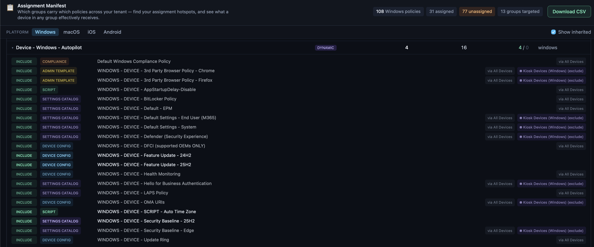

_The effective policy set for one group: direct assignments, inherited policies tagged with their source, and excludes at the bottom._

- Inherited policies are tagged **"via All Devices"** / **"via <group>"**, and implied ones are flagged as such.
- Intune's **exclude-wins** rule is applied: a policy the group is excluded from is dropped from the applied list and shown only as an exclude, so it's clear *why* it doesn't apply.

## All Devices / All Users inheritance

Every group inherits the All Devices and All Users assignments. The Manifest counts them explicitly in the **Inherited** column and lists them in the expanded detail — so the tenant-wide baseline is visible rather than assumed. A **Show inherited** toggle turns it off if you want to see direct assignments only.

## Assignment filter simulation

Click any **⛃ filter chip** — or use the **Simulate device filters** toggles in the toolbar — to treat the device as matching that filter. Because filter membership is a property of the *device*, the toggle is global: **every group recomputes at once.**

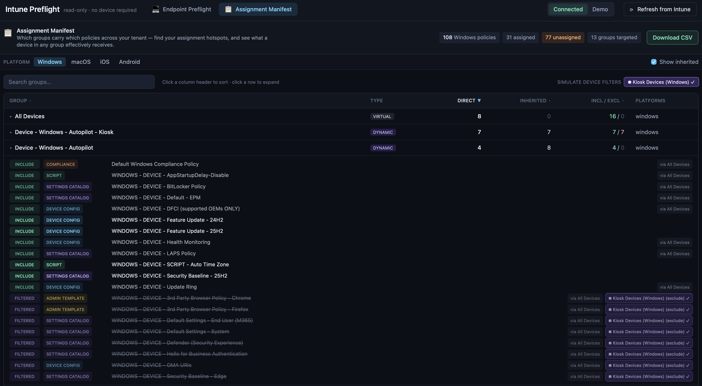

_Toggle a filter and watch the whole tenant re-resolve. Policies the filter drops move to a struck-through "Filtered" line with the reason._

This is the fastest way to answer *"what does my Kiosk filter actually do to my policy set?"* — a question that's genuinely painful to work out in the Intune console.

## Send groups to the simulator

The Manifest and the simulator are two lenses on the same data, so they connect. Tick the checkbox on one or more groups and a bar rises from the bottom: **"Simulate a device in these groups →"**. It drops you into Endpoint Preflight seeded with exactly those groups — plus any device filters you were simulating here — on the Manifest's current OS, recomputing the full merged baseline from scratch. You go from *"which groups look interesting"* to *"what a device in them actually gets"* in one click. (All Devices / All Users always apply, so they're marked *always applies* rather than something you select.)

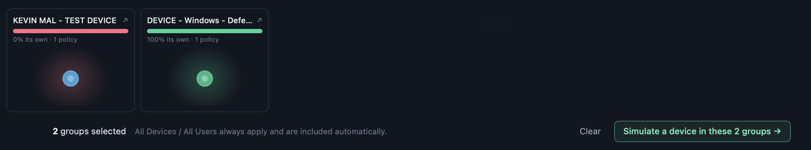

_Check groups in the Manifest, then simulate a device in exactly those groups._

## Per-group policy "seating charts"

As you check groups, a strip above the bar shows each one as a small bubble cluster — a preflight seating check. Every bubble is a policy the group carries, colored by **how shared it is: cool = unique to this group, hot = carried by many groups (bleed)** — with a distinct indigo ⚠ flag for anything scoped to All Devices / All Users *and* a direct group (an assignment Intune's portal normally disallows). A containment bar reads **"68% its own"** at a glance.

Click a chart to open the full **named policy list**: heat-colored chips, unique policies first, and clicking any policy names exactly which other groups carry it. It answers, in one motion, whether a group is its own tidy container or quietly overcrowded with policies borrowed from everywhere — the shared-use view, with no guesswork.

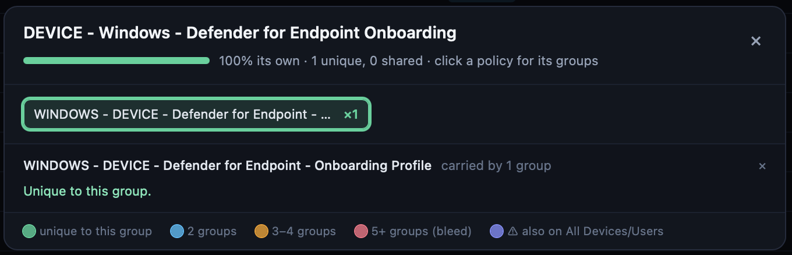

_Each checked group's policies as a heat cluster; click through to the named chip list and see which groups share each policy._

## Export

Download the full manifest as CSV — the raw per-assignment detail, ready to pivot by Group or Policy in Excel.


_CSV export of every policy → group assignment for the selected platform._

> **Shared use is now visible** through the per-group seating charts above — where the *same policy* is assigned across multiple Entra groups. Surfacing group *pairs* whose combined assignment produces conflicts is parked under *Under consideration* in [ROADMAP.md](../ROADMAP.md).

---

## Built for real tenants

A few things that matter once you point this at a production-sized tenant:

- **Fast on large tenants.** Assignments are pulled inline with each collection and per-policy detail calls run with bounded concurrency — a 140-policy tenant loads in seconds.
- **Resilient to flaky Graph.** Throttling (429) and transient gateway errors (502/503/504) are retried with backoff, and every request has a timeout so one wedged connection can't stall a load.
- **Never silently incomplete.** If anything fails to import after retries, the app shows a clear **"Incomplete load"** banner naming what dropped, and the server logs a summary. A partial baseline is never presented as a complete one.
- **Refresh on demand.** An in-memory cache keeps things fast; **Refresh from Intune** clears it and re-reads the tenant after you make changes in the admin center.
